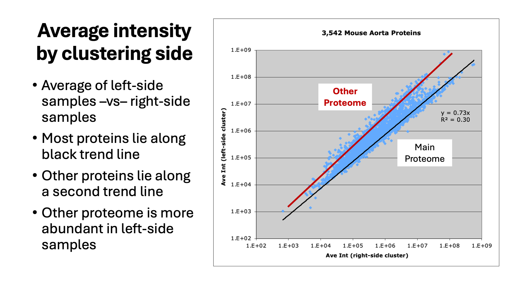

# power_of_proteomes
### Dr. Phillip Wilmarth
#### Senior Staff Scientist, PSR Core, Oregon Health & Science University
#### October 27, 2025

Why do proteomics experiments to measure whole proteomes yet still think in terms of single proteins?

---

## Proteomes presentation:

---

_Slide 1_

Prepared October 27, 2025, by Phil Wilmarth, PSR Core, OHSU. Is it about time for proteomics to start thinking about proteomes? After nearly 30 years of single protein quantitative proteomes, it is time to think about whole proteomes.

---

_Slide 2_

What are proteomes? Are they just parts lists? Most parts lists also specify the number of each type of part. Don’t you sort the bag of fasteners from that IKEA purchase, count the items, and compare that to the parts list in the instructions before you start putting it together? We can do similar checks when we measure whole proteomes (a list of protein present in the samples and some relative abundance measure that can be used to rank proteins from high abundance to low abundance). There is usually a lot that is known about any sample type from years of prior study. A logical first sanity check is whether the proteome you measured bears some resemblance to what was known about the proteome. LC systems and mass spectrometers have limited dynamic ranges, and many proteomes can have larger dynamic ranges. You can’t identify proteins below the measuring system’s limit of detection no matter how much mass spec noise you impute. Most studies now focus on quantitation, and the limit of quantification is always less than the limits of detection. Whole proteomes can help you figure out ballpark limits of detection and limits of quantitation so don’t look like a fool when analyzing the data.

Body fluids  and cell lysates have very different proteomes. Proteomes with a smaller number of highly abundant proteins have profound implications for data normalization and statistical testing. Cell lysates with broad distributions of protein relative abundances are much more forgiving when it come to data analysis choices.

There is too little consensus in the filed about contaminants. Common contaminants, such as, trypsin autolysis peptides, hair and skin keratins (unless you are studying hair and/or skin) should be excluded from downstream data analysis. What about blood proteins? Do you use bovine serum albumin to check your instrument performance? Do your samples have significant blood components? Plasma and serum certainly do. Should albumin be a protein in a common contaminants collection? Should albumin always be considered a contaminant protein? Immunoglobulin proteins in bio fluids are another issue. Immunoglobulins are overrepresented in FASTA files (how to represent immunoglobulins in protein sequence collections is far more complicated a topic that you would imagine). In bottom-up experiments, immunoglobulin complexes are disrupted and digested into peptides. Any knowledge of where immunoglobulin peptides might have come from (IgG, IgA, etc.) are lost and not recoverable. Immunoglobulins in bio fluids should be reported and quantified as one protein family.

There are many examples of more complicated proteome contamination situations. Some tissues are difficult to dissect cleanly and may have variable contamination from adjacent tissues (that likely have different proteomes). Many secreted bio fluids have dynamics to need to be considered. Stimulated tears (crying, from irritation in the eye, dry air, cold air, etc.) have a different composition from basil tearing. Saliva also has stimulated parotid gland secretion in response to mechanical chewing, levels of acid in foods, etc.) that changes the composition of saliva compared to the unstimulated state.

---

_Slide 3_

It is really difficult to notice the presence of a second contaminating proteome in samples without considering whole proteomes. All proteome experiments have some homework that needs to be done before tackling the actual experiment. You need an experimental design that can answer an interesting biological question. That may take some pilot studies to work out. Sample collection and sample preparation needs to be practiced to reduce non-biological variability so that biological changes can actually be measured.

Once you have raised an interesting question, figured out an experiment to answer the question, optimized the sample collection and preparation, figured out an LC-MS technique that can measure what you need to address the question, you can perform your experiment and collect data. Data analysis in bottom-up quantitative proteomics experiments is not trivial. FASTA file choice, search engine and/or pipeline choice, search engine settings, and data summarization choices all strongly affect what you get for the protein relative abundance data table. That data will need to be run through data normalization algorithms and used in statistical modeling steps. You have to get the protein relative abundance data table right before you can get any meaningful statistical testing results.

Several data quality control metrics need to be computed, visualized, and understood to know if the protein relative abundance data table is okay for use in downstream steps or if you need to try different choices in the upstream steps. These data QC steps are where the presence possible contaminating proteomes can be seen. If the data suggests mixed proteomes, how to resolve that will need to be addressed. It might involve revisiting the sample collection methods to increase purity of the main proteome of interest. It might involve excluding samples if some samples have contamination and others do not (and that there are enough replicates of non-contaminated samples). Maybe trying to define the proteins present in the contaminating proteome and excluding those proteins from statistical analysis could be done.

---

_Slide 4_

A recent client project had evidence of a contaminating second proteome in TMT-labeled tissue samples. The tissues of interest were mouse mammary glands in a breast cancer model. It is difficult to dissect the glands without also collecting some adjacent muscle tissue. We had a proteome for human skeletal muscle from a previous project from another client. Assuming mouse muscle and mouse mammary gland have different proteomes (a set of proteins with some relative abundance measure) and that the adjacent mouse muscle proteome would have some similarity to human skeletal muscle, the top 100 or so proteins (by relative abundance) in human muscle were mapped to their mouse orthologs by gene symbols. The possible mouse muscle protein markers (88 proteins) had their intensities summed for each sample to track total muscle levels present. The 88 proteins could also be highlighted in scatter plots to verify contaminant pattern.

---

_Slide 5_

The total intensity of the 88 muscle proteins in combination with all the other QC evidence, clearly shows that the 4 proteins that cluster on the left side of the MDS plot have high levels of muscle contamination. The 2 proteins in the center of the cluster plot have lower muscle contamination levels but are still distinguishable from non-contaminated samples. The scatter plot on the right has the 88 muscle proteins highlighted in red. The WT-3957 intensities are the y-axis values. The x-axis values are the average of the other 5 WT samples. The muscle proteins are clearly the second proteome in the QC notebook sample-to-sample scatter plots. Note that these proteins are also present in the mammy gland cells because the points fall on a diagonal trend line rather than along the y-axes. These 88 proteins are probably a subset of the contaminating muscle proteome.

---

_Slide 6_

Doing an experiment over with cleaner sample collection that eliminates the second proteome contamination is, surprisingly, seldom the first choice to fix this problem. The first choice is to invoke some sort of software magic that fixes everything. That must be the “silk purse from a sow’s ear” package that I could not get to install. There are two choices if you do not want to redo the experiment: exclude samples or exclude proteins. Of the two strategies (excluding samples with high muscle content or trying to define a list of muscle proteins to exclude from quantitative analysis), dropping samples may be safer for this experiment. The replicate numbers per biological group after dropping samples would still be sufficient for statistical testing.

---

_Slide 7_

Another recent project’s data analysis was started, and similar contaminating proteome evidence was observed in the QC notebooks for the TMT-labeled samples. The project involves mouse aorta tissue. There are 3 genotypes and some different ages of mice. There are several biological groups with variable (generally low) numbers of replicates. Aorta is a very difficult tissue to homogenize, and blood is always present in heart/aorta tissue. Tissue samples were washed to remove blood before homogenization and digestion. The tissue homogenization involves aggressive bead beating. Hemoglobins, albumin, other major blood proteins (Sigma top 20 list), and many immunoglobulin proteins were detected indicating that blood was present in the samples. However, there seemed to be many additional proteins and protein families that were variable between samples. This suggests that more than just blood might be involved in the contamination.

---

_Slide 8_

A zebrafish lens study using DIA was recently published in JASMS and I was curious what the data was like (I have not generated any DIA data personally).

---

_Slide 9_

A zebrafish lens study using DIA was recently published in JASMS and I was curious what the data was like (I have not generated any DIA data personally).

---

_Slide 10_

A zebrafish lens study using DIA was recently published in JASMS and I was curious what the data was like (I have not generated any DIA data personally).

---

_Slide 11_

A zebrafish lens study using DIA was recently published in JASMS and I was curious what the data was like (I have not generated any DIA data personally).

---

_Slide 12_

A zebrafish lens study using DIA was recently published in JASMS and I was curious what the data was like (I have not generated any DIA data personally).

---

_Slide 13_

A zebrafish lens study using DIA was recently published in JASMS and I was curious what the data was like (I have not generated any DIA data personally).

---

_Slide 14_

A zebrafish lens study using DIA was recently published in JASMS and I was curious what the data was like (I have not generated any DIA data personally).

---

_Slide 15_

A zebrafish lens study using DIA was recently published in JASMS and I was curious what the data was like (I have not generated any DIA data personally).

---

_Slide 16_

A zebrafish lens study using DIA was recently published in JASMS and I was curious what the data was like (I have not generated any DIA data personally).

---

Phil Wilmarth   October 27, 2025  
